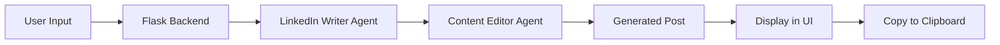

# 🚀 LinkedIn Post Generator

An AI-powered web application that creates engaging, professional LinkedIn posts in seconds using multi-agent collaboration.


---

## ✨ Features

- 🤖 **AI-Powered Content Generation** - Uses advanced LLM models via Groq API
- 👥 **Multi-Agent System** - Two specialized AI agents work collaboratively
- 🎨 **Beautiful Modern UI** - Responsive and interactive web interface
- 📋 **One-Click Copy** - Instantly copy generated posts to clipboard
- 📊 **Real-Time Stats** - Word count, hashtags, and line metrics
- ⚡ **Fast Generation** - Powered by Groq's lightning-fast inference
- 💡 **Example Topics** - Quick-start with pre-defined topic suggestions

---

## 🏗️ Architecture

This project uses a **multi-agent AI system** built with CrewAI:

```
User Input → LinkedIn Writer Agent → Content Editor Agent → Polished Post
```

### 🤖 AI Agents

1. **LinkedIn Content Strategist**
   - Creates engaging post drafts
   - Focuses on storytelling and hooks
   - Generates actionable insights

2. **Content Editor**
   - Polishes and optimizes content
   - Adds relevant hashtags
   - Ensures LinkedIn best practices

---

## 🛠️ Tech Stack

| Component | Technology | Purpose |
|-----------|-----------|---------|
| **Backend Framework** | Flask | Web server and API |
| **AI Orchestration** | CrewAI | Multi-agent collaboration |
| **LLM Provider** | Groq API | Fast AI inference |
| **AI Model** | Llama 3.3 70B | Content generation |
| **Frontend** | HTML/CSS/JS | Interactive UI |
| **UI Design** | Claude AI | Modern interface design |

### 🎨 UI Design Credits
The beautiful, responsive user interface was designed and created by **Claude AI** (Anthropic), featuring:
- Modern gradient designs
- Smooth animations
- Intuitive user experience
- Mobile-responsive layout

---

## 📋 Prerequisites

- Python 3.8 or higher
- Groq API key (free tier available)
- Internet connection

---

## 🚀 Installation

### 1. Clone or Download the Repository

```bash
git clone <your-repo-url>
cd linkedin-post-generator
```

### 2. Create Virtual Environment (Recommended)

```bash
# Windows
python -m venv env
env\Scripts\activate

# macOS/Linux
python3 -m venv env
source env/bin/activate
```

### 3. Install Dependencies

```bash
pip install flask crewai groq
```

### 4. Set Up API Key

Open `main3.py` and add your Groq API key:

```python
os.environ["GROQ_API_KEY"] = "your_api_key_here"
```

**Get your free API key:** https://console.groq.com

---

## 🎮 Usage

### Start the Application

```bash
python main3.py
```

You should see:

```
======================================================================
🚀 LinkedIn Post Generator Web App
======================================================================
✨ Starting server...
🌐 Open your browser and go to: http://localhost:5000
💡 Press Ctrl+C to stop the server
======================================================================
```

### Access the Web Interface

1. Open your web browser
2. Navigate to: `http://localhost:5000`
3. Enter your topic or click an example topic
4. Click "Generate LinkedIn Post"
5. Copy and paste to LinkedIn!

---

## 📸 Screenshots

### Main Interface
- Purple gradient background with LinkedIn blue accent
- Clean, modern input field
- Quick-select topic chips
- Real-time generation status

### Generated Post View
- Formatted post preview
- Statistics dashboard (words, hashtags, lines)
- One-click copy functionality

---

## 💡 Example Topics

The app includes these pre-configured topics:
- AI in healthcare
- Remote work productivity
- Leadership lessons
- Career growth tips
- Digital transformation

Or create your own custom topics!

---

## 🔧 Configuration

### Change Port

Edit the last line in `main3.py`:

```python
app.run(debug=True, host='0.0.0.0', port=5001)  # Change 5000 to any port
```

### Adjust AI Temperature

Modify the LLM configuration:

```python
llm = LLM(
    model="groq/llama-3.3-70b-versatile",
    temperature=0.7  # 0.0 = focused, 1.0 = creative
)
```

### Customize Agent Behavior

Edit the agent backstories and task descriptions in `main3.py` to match your content style.

---

## 📊 How It Works



### Step-by-Step Process

1. **User enters topic** via web interface
2. **Flask receives request** and passes to CrewAI
3. **Writer Agent** creates initial post draft
4. **Editor Agent** polishes and optimizes
5. **Result returned** to frontend
6. **UI displays** formatted post with statistics

---

## 🤝 Contributing

Contributions are welcome! Here's how you can help:

1. Fork the repository
2. Create a feature branch (`git checkout -b feature/AmazingFeature`)
3. Commit your changes (`git commit -m 'Add some AmazingFeature'`)
4. Push to the branch (`git push origin feature/AmazingFeature`)
5. Open a Pull Request

### Ideas for Contributions
- Add more AI agents (e.g., SEO optimizer, engagement predictor)
- Support multiple post formats (Twitter, Instagram)
- Add post scheduling features
- Implement user authentication
- Create post templates library

---

## 🐛 Troubleshooting

### Port Already in Use
```bash
# Change port in main3.py or kill existing process
netstat -ano | findstr :5000  # Windows
lsof -ti:5000 | xargs kill    # macOS/Linux
```

### API Key Error
- Verify your Groq API key is correct
- Check your API quota hasn't been exceeded
- Ensure internet connection is active

### Generation Timeout
- Check your internet connection
- Try a simpler topic
- Restart the Flask server

### Blank Page
- Clear browser cache
- Try a different browser
- Check console for JavaScript errors (F12)

---

## 📝 License

This project is licensed under the MIT License - see below for details:

```
MIT License

Copyright (c) 2025

Permission is hereby granted, free of charge, to any person obtaining a copy
of this software and associated documentation files (the "Software"), to deal
in the Software without restriction, including without limitation the rights
to use, copy, modify, merge, publish, distribute, sublicense, and/or sell
copies of the Software, and to permit persons to whom the Software is
furnished to do so, subject to the following conditions:

The above copyright notice and this permission notice shall be included in all
copies or substantial portions of the Software.

THE SOFTWARE IS PROVIDED "AS IS", WITHOUT WARRANTY OF ANY KIND, EXPRESS OR
IMPLIED, INCLUDING BUT NOT LIMITED TO THE WARRANTIES OF MERCHANTABILITY,
FITNESS FOR A PARTICULAR PURPOSE AND NONINFRINGEMENT. IN NO EVENT SHALL THE
AUTHORS OR COPYRIGHT HOLDERS BE LIABLE FOR ANY CLAIM, DAMAGES OR OTHER
LIABILITY, WHETHER IN AN ACTION OF CONTRACT, TORT OR OTHERWISE, ARISING FROM,
OUT OF OR IN CONNECTION WITH THE SOFTWARE OR THE USE OR OTHER DEALINGS IN THE
SOFTWARE.
```

---

## 🙏 Acknowledgments

- **CrewAI** - For the amazing multi-agent framework
- **Groq** - For providing fast, free LLM inference
- **Meta AI** - For the Llama 3.3 70B model
- **Claude AI by Anthropic** - For designing the beautiful, modern UI
- **Flask** - For the lightweight web framework

---

## 📞 Support

Having issues? Here's how to get help:

1. Check the [Troubleshooting](#-troubleshooting) section
2. Review [CrewAI documentation](https://docs.crewai.com)
3. Check [Groq API docs](https://console.groq.com/docs)
4. Open an issue on GitHub

---

## 🔮 Future Enhancements

- [ ] User authentication and saved posts
- [ ] Post analytics and engagement predictions
- [ ] Multi-language support
- [ ] A/B testing for post variations
- [ ] Integration with LinkedIn API for direct posting
- [ ] Post scheduling functionality
- [ ] Content calendar management
- [ ] Team collaboration features

---

## 📈 Project Stats

- **Lines of Code:** ~650
- **AI Agents:** 2
- **Generation Time:** 3-5 seconds average
- **Supported Topics:** Unlimited
- **Cost:** Free (using Groq free tier)

---

## 🌟 Star History

If you find this project helpful, please consider giving it a star! ⭐

---

## 📧 Contact

For questions or feedback:
- Create an issue on GitHub
- Email: your-email@example.com
- LinkedIn: your-linkedin-profile

---

<div align="center">

**Made with ❤️ using CrewAI, Groq, and Claude AI**

[⬆ Back to Top](#-linkedin-post-generator)

</div>
